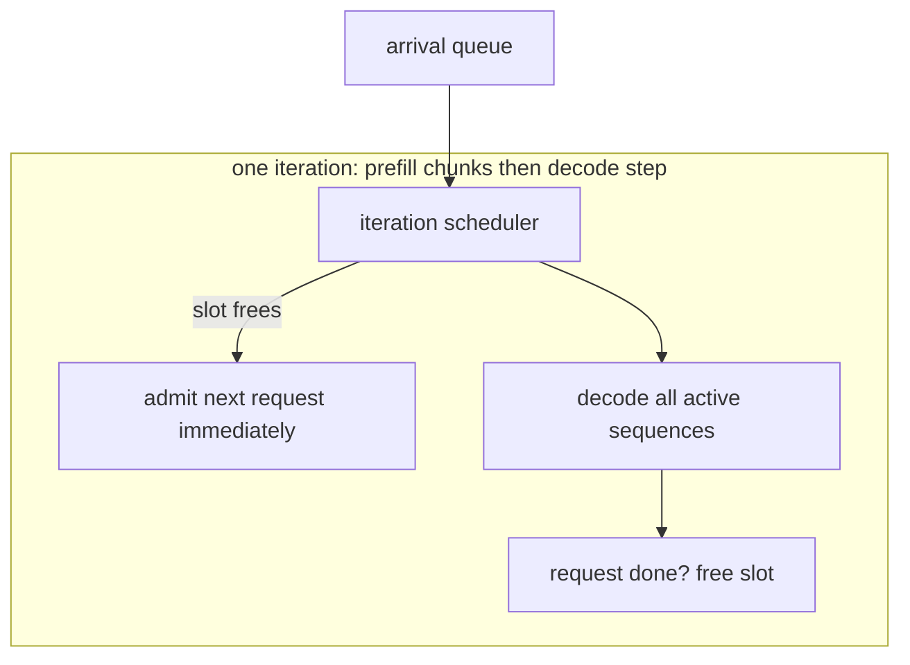

# cplan — the scheduler is the product, the GPU is constant

**One-sentence pitch:** with a fixed per-iteration engine cost, nearly all of TTFT and SLO attainment variance comes from *scheduling* — this simulator isolates that variable: identical arrivals, identical engine model, only the batching policy differs.

## TL;DR (Poisson arrivals, 16-slot engine, receipts in `receipts/`)

| Arrival rate | Static: mean TTFT | Continuous: mean TTFT | Improvement |
|---|---|---|---|
| 0.8 req/s | 235 ms | 21 ms | **90%** |
| 1.5 req/s | 490 ms | 36 ms | **93%** |
| 4.0 req/s | 1730 ms | 64 ms | **96%** |

At the 1.5s SLO point: continuous attains **100%** vs static **62%**.



## Why

Static batching runs a batch to its *longest* member — every short request pays head-of-line blocking for the batch's tail. Continuous batching (iteration-level scheduling, chunked prefill) never lets a slot idle while a request queues. The demo isolates exactly this: same arrival trace, same cost model, policy is the only difference. The simulator *labels itself* a simulator — absolute numbers track your cost-model inputs; the comparative result is the invariant, and it holds across every sweep the tests run.

Prior art: Orca (Yu et al., OSDI 2022) for iteration-level scheduling; chunked prefill as shipped in modern serving engines.

## Quickstart

```bash
pip install -e ".[dev]"
pytest tests/ -q        # 6 tests: TTFT/p99/SLO dominance, slot scaling, chunking
python demos/demo.py    # rate sweep + receipts/batching.png
```
