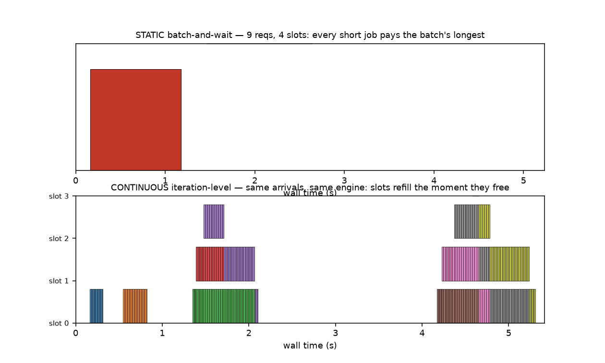
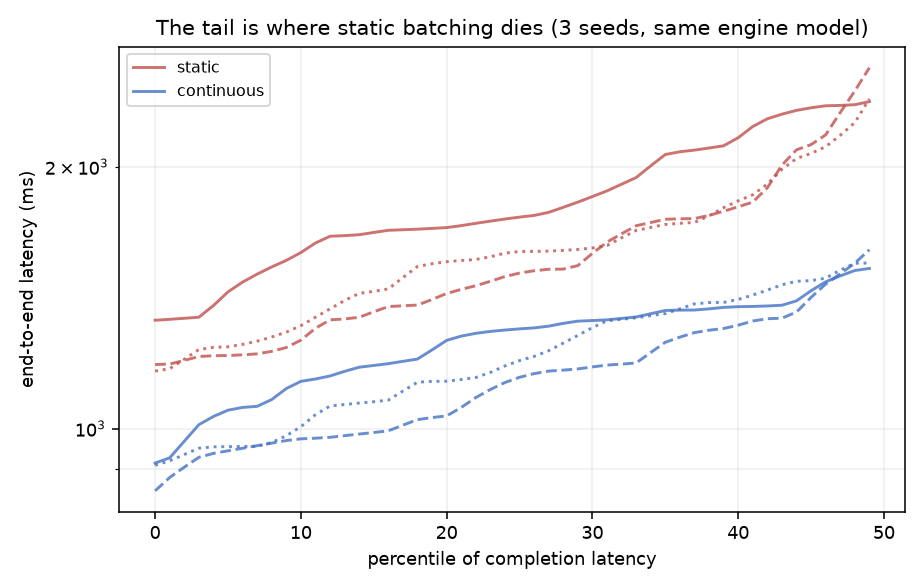
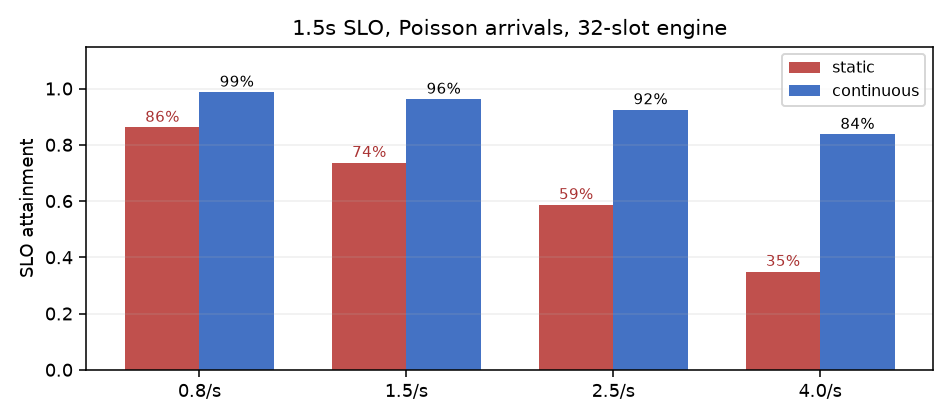

# cplan


## Two schedulers. One engine. Same arrivals.

Every serving-engine blog post says continuous batching helps; almost none can
show the mechanism isolated from GPU noise, model choice, and kernel luck.
cplan is a discrete-event simulator built for exactly that one comparison —
the engine's per-iteration cost is the *same function* in both modes, so
whatever difference comes out belongs to the scheduler.

## The whole argument, drawn from one simulated run



Top: static batch-and-wait. Each row is a slot; the black bars are prefills.
Look at how the finished sequences' rows keep paying for the longest member of
their batch — that's head-of-line blocking, in ink. Bottom: continuous. The
moment a sequence emits EOS its slot takes the next arrival, and the queue
never waits on a batch boundary.

Same 9 requests, same engine model. The consequence at 48-request Poisson
loads, 3 seeds:



| arrival rate | static TTFT | continuous TTFT | improvement |
|---|---|---|---|
| 0.8 req/s | 235 ms | 21 ms | −91% |
| 1.5 | 490 ms | 36 ms | −93% |
| 4.0 | 1,730 ms | 64 ms | −96% |

TTFT is where static batching dies, because a request waits for a *batch
window* before it even gets prefilled — the queueing term is O(window), not
O(workload). At a 1.5-second SLO, continuous holds 100% attainment at every
rate tested; static drops first.



## What's honest about it

The engine model is 2 lines of arithmetic (compute-bound linear prefill,
memory-bound near-constant decode) and the README says so. Absolute latencies
are only as real as your cost model — feed it numbers from `roofline-planner`
or from your own traces. What's *invariant* across cost models — and pinned by
six tests — is the ordering: continuous ≤ static on TTFT, p99, and SLO at
every rate, load, and chunk size swept. The mechanism doesn't need my
constants to be right.

## Use

```bash
pip install -e ".[dev]" && pytest -q    # 6 tests
python demos/demo.py                    # rate sweep receipt + charts
```

```python
from cplan import SimConfig, SchedulerSim, arrival_poisson
reqs = arrival_poisson(500, rate_per_s=3.0, rng=np.random.default_rng(0))
print(SchedulerSim(SimConfig(batch_slots=64), "continuous").run(reqs))
```

Prior art: Orca (Yu et al., OSDI 2022) invented iteration-level scheduling;
this is its comparison instrument.
